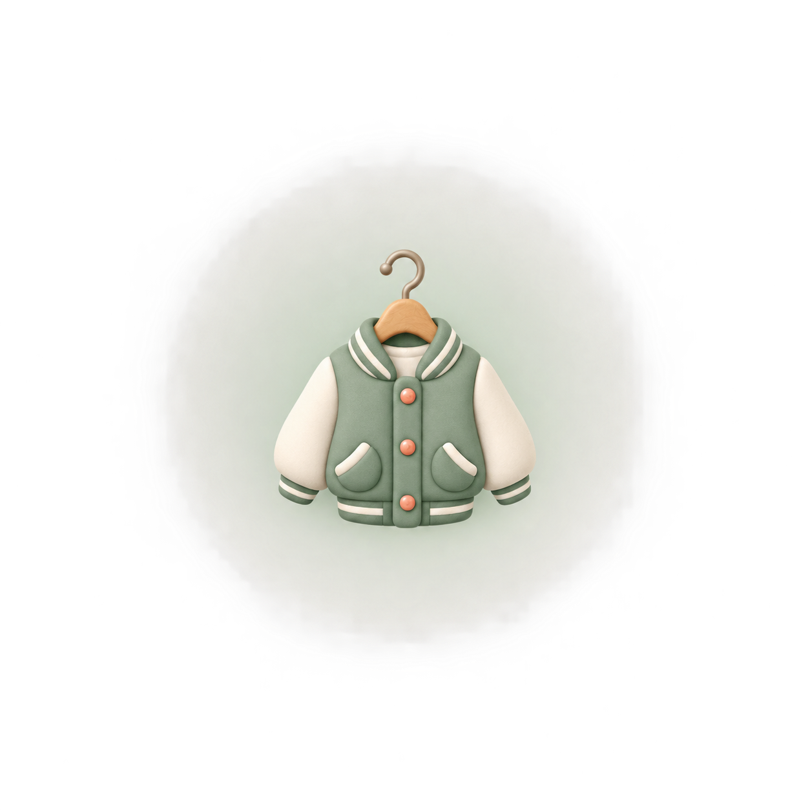
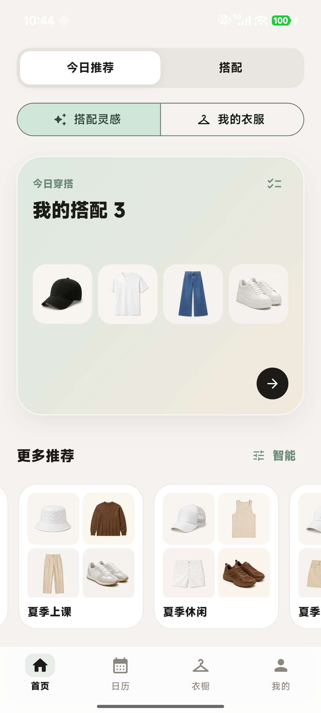
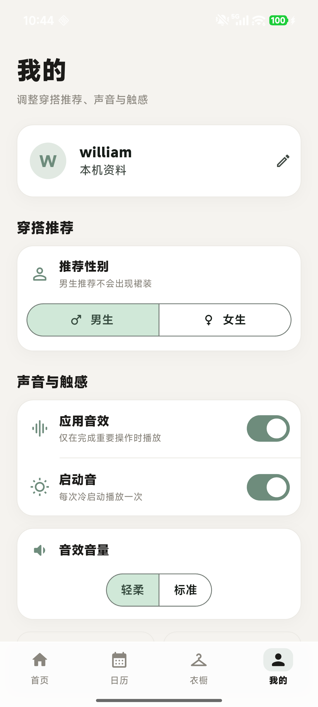

# 衣搭 YiDa

<p align="center">
  
</p>

<p align="center"><strong>面向大学生的穿搭推荐、模块化试衣与数字衣橱 App</strong></p>

衣搭使用 Flutter 开发，支持男女穿搭推荐、真实天气、个人衣物导入、离线衣物抠图、搭配保存和穿搭日历。界面以米白与鼠尾草绿为主，强调清爽、克制和易操作。

## 界面预览

<p align="center">
  
  &nbsp;&nbsp;
  
</p>

## 核心能力

### 今日推荐

- 根据用户性别、季节、当地天气和个人衣橱生成穿搭
- 区分“搭配灵感”和“我的衣服”，缺少单品时使用系统衣物补齐
- 雨天提醒、分时段问候以及今日穿搭待办

### 模块化试衣间

- 帽子、上衣、下装、鞋子四个部位自由组合
- 每个部位都可以选择“无”，支持非全身搭配
- 按颜色、材质和款式筛选 432 张系统衣物
- 当前组合可保存、命名、分享，或无需保存直接设为今日穿搭

### 个人衣橱

- 拍照添加衣服，取景框会随衣物类别变化
- 拍照界面左下角可直接从系统相册选择商品图
- 使用设备内置 ONNX 模型进行衣物识别和背景处理
- 用户可设置颜色、材质和款式，也可以删除自己的衣服
- 系统衣物只读，避免误删基础目录

### 穿搭日历

- 为不同日期安排已保存搭配
- 与首页“今日穿搭”同步
- 支持更换或移除当天安排

## 技术架构

```text
Flutter UI
├─ 推荐与天气服务
├─ 模块化试衣间
├─ 衣橱与筛选系统
├─ 搭配保存与日历
└─ MethodChannel
   └─ Android / ONNX Runtime 离线衣物处理
```

| 项目 | 配置 |
|---|---|
| UI | Flutter / Dart |
| Android | Kotlin、Android SDK、JDK 17 |
| 本地推理 | ONNX Runtime + U2NetP |
| 最低 Android 版本 | API 24 |
| CPU 架构 | ARM64 (`arm64-v8a`) |
| 应用包名 | `com.dressfit.dressfit_app` |

## 本地运行

准备 Flutter、Android SDK 和 JDK 17，然后执行：

```bash
flutter pub get
flutter run
```

## 检查与测试

```bash
flutter analyze
flutter test
```

测试覆盖衣物分类标准化、旧数据迁移、部分搭配保存、性别推荐限制、季节规则和主要界面流程。

## 构建 APK

调试包：

```bash
flutter build apk --debug --target-platform android-arm64
```

Release 模式：

```bash
flutter build apk --release --target-platform android-arm64
```

构建结果位于 `build/app/outputs/flutter-apk/`。

> 仓库当前为了本地测试，release 构建仍使用调试签名。公开发布前请创建自己的 Android keystore，并替换 `android/app/build.gradle.kts` 中的签名配置。

## 数据与隐私

- 用户衣橱、搭配、偏好和日历默认保存在设备本地。
- 衣物抠图模型随应用提供，处理过程不要求上传用户照片。
- 天气功能需要位置权限和网络连接。
- `android/local.properties`、签名文件、构建缓存和设备数据不会提交到仓库。
